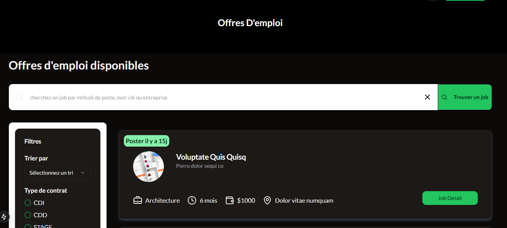

# 🚀 JobBoard Client (Next.js)

Client **Frontend** de l'application **JobBoard** développé avec **Next.js**, **TypeScript**, **TailwindCSS** et **Shadcn/UI**.  
Il permet la publication d'offres d'emploi, la gestion des candidatures et la consultation d'annonces pour les utilisateurs.

---

## 📑 Fonctionnalités principales

- ✅ Authentification sécurisée (JWT via API)
- ✅ Gestion des rôles (Candidat / Recruteur / Admin)
- ✅ CRUD des offres d’emploi
- ✅ Candidature aux offres
- ✅ Gestion des candidatures (statut, suivi)
- ✅ UI moderne et responsive
- ✅ Intégration API via Axios / React Query

---

## 🏗️ Technologies utilisées

| Framework    | Librairies UI     | State & Data       | Outils Divers    |
|--------------|------------------|--------------------|------------------|
| **Next.js 14+**   | **TailwindCSS**   | **TanStack Query** | **Zod (validation)** |
| **TypeScript** | **Shadcn/UI**     | **Axios (API)**    | **React Hook Form**  |

---

## 🔧 Installation

1️⃣ Clone le dépôt :  
```bash
git clone https://github.com/steeven-louk/jobboard_client.git
cd jobboard_client
```

2️⃣ Installation des dépendances :
```bash
npm install
```

3️⃣ Fichier .env.local :
```bash
NEXT_PUBLIC_API_URL=http://localhost:3000/api
```

4️⃣ Lancer le serveur de développement :
```bash
npm run dev
```

## 🌐 Structure du projet (simplifiée)
```bash
/src
├── app/               # Routing Next.js (app directory)
├── components/        # UI Components (cards, inputs, buttons, etc.)
├── lib/               # Fonctions utilitaires (api, auth, etc.)
├── types/             # Types globaux
├── stores/            # State Management (optionnel : Zustand)
└── pages/             # API Routes ou pages spéciales
```
## 📸 Aperçu de l'application

<p align="center">
  
  <br/>
  
</p>

## 🧪 Tests
👉 À implémenter

* Tests unitaires : Jest / Testing Library
* Tests e2e : Playwright / Cypress

## 🚩 Scripts utiles
| Commande    | Action     |
|--------------|------------------|
| **npm run dev**   | **Lancer le serveur de développement** |
| **npm run build** | **Build production** |
| **npm run start** | **Démarrer Next.js en production**   |

## 👤 Auteur
Steeven Loukanou

## 📝 Licence
Ce projet est distribué sous la licence MIT.

